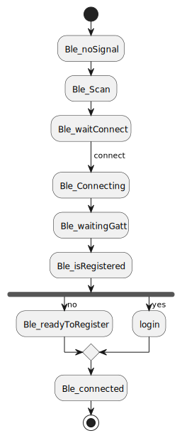

# SesameOS3 SDK for iOS

[日本語の読み方] "セサミオーエススリー　エスディーケー フォー アイオーエス"

## 

[CANDY HOUSE 公式サイト](https://jp.candyhouse.co/)

## プロジェクト概要

#### SesameSDKは、Androidアプリのためのシンプルで強力な無料のBluetooth/モノのインターネット（IoT）ライブラリです。Sesameの公式アプリもこのSesameSDKを使用して構築されており、Sesameアプリのすべての機能は、このSesameSDK、SesameSDKを使用して実現することができます：

- Sesameデバイスの登録（Sesame 5、Sesame 5 Pro、Sesame Bike2、Sesame BLE Connector1、Sesame open sensor、Sesame Touch 1 Pro、 Sesame Touch 1 、WIFI Module2）
- ロックとアンロック

- 履歴を見る
- 更新 SesameOS3
- SesameOS3 機器の各種設定
- バッテリー残量の取得

#### このプロジェクト SesameOS3 は、主にハードウェアデバイス　Sesame 5、Sesame 5 Pro、Sesame Bike2、Sesame BLE Connector1、Sesame open sensor、Sesame Touch 1 Pro、 Sesame Touch 1 、WIFI Module2 などを解決します。 製品はBluetooth経由で接続されています。 iOSアプリケーションを介してインテリジェントにハードウェアを操作するためにユーザーを支援します。

### 1. プロジェクトの依存関係

- [Sesame 5] :このオブジェクトの例は、Sesame5およびSesame5 Pro製品に適用されます
- [Sesame Bike 2] :このオブジェクトの例は、Sesame Bike 2製品に適用されます
- [Sesame WiFi Module 2]:このオブジェクトの例は、Sesame WiFi Module 2 製品に適用されます
- [Sesame Touch Pro]:このオブジェクトの例は、Sesame BLE Connector1、Sesame Touch 1 Pro、Sesame Touch 1　製品に適用されます
- [Sesame Open Sensor 1]:このオブジェクトの例は、Sesame Open Sensor 1 製品に適用されます
- [Class 対象]

### サイクル図

### [SesameSDK 利用規約](https://jp.candyhouse.co/pages/sesamesdk%E5%88%A9%E7%94%A8%E8%A6%8F%E7%B4%84)
