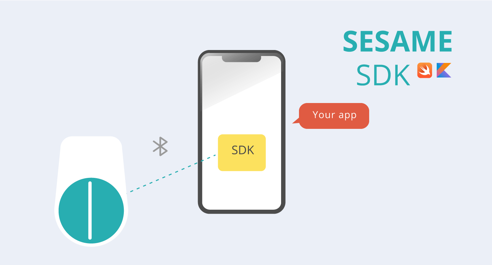

# SesameSDK3.0 for iOS

## [CANDY HOUSE Official Site](https://jp.candyhouse.co/)

##### App Store [Sesame app](https://apps.apple.com/cn/app/sesame-%E8%8A%9D%E9%BA%BB%E5%BC%80%E9%97%A8/id1532692301)

## Contents
- [Overview](#overview)
- [Requirements](#requirements)
- [Installation](#installation)
- [Usage](#usage)
- [Design](#design)
- [Terms of Use](#sesamesdk-terms-of-use)

## Overview

#### SesameSDK is a free, simple, and powerful Bluetooth library for iOS applications. The official Sesame application also uses this SesameSDK to build and realize all its features. Things you can do with SesameSDK:

- Register Sesame devices (Sesame 5, Sesame 5 pro, Sesame Bike2, BLE Connector1, Open Sensor1, Sesame Touch 1 Pro, Sesame Touch 1, Sesame Bot1, WIFI Module2, Sesame 4, Sesame 3, Sesame Bike1)
- Lock, unlock, and operate
- Obtain historical records
- Update of SesameOS3
- Various device settings
- Get battery level

## Requirements
- iOS 12.0+ / Mac OS X 10.15+ / WatchOS 7.0+
- Xcode 11.0 +
- Swift 5.3 +

## Installation
### Swift Package Manager
[Swift Package Manager](https://www.swift.org/package-manager/) is a tool for managing the distribution of Swift code. It integrates with the Swift build system to automatically carry out the process of downloading, compiling, and linking dependencies.
To integrate SesameSDK into your Xcode project using Swift Package Manager:

```
dependencies: [
    .package(url: "https://github.com/CANDY-HOUSE/SesameSDK_iOS_with_DemoApp.git", .branch("master"))
]
```

### Manually
If you don't want to use any dependency manager, you can manually integrate SesameSDK into your project.


## Usage
### 1. Add Permissions
```
<key>NSBluetoothAlwaysUsageDescription</key>
<string>To connect Sesame Smart Lock and lock/unlock the door.</string>
<key>NSBluetoothPeripheralUsageDescription</key>
<string>This app would like to make data available to nearby bluetooth devices even when you're not using the app.</string>
```

### 2. Initialization
Please start the Bluetooth scan at the appropriate time
```
CHBluetoothCenter.shared.enableScan { res in }
```
Callback when the Bluetooth status changes
```
public protocol CHBleStatusDelegate: AnyObject {
    func didScanChange(status: CHScanStatus)
}
```
The list of scanned Sesame devices will be passed back to the caller at a frequency of once per second.
```
public protocol CHBleManagerDelegate: AnyObject {
    func didDiscoverUnRegisteredCHDevices(_ devices: [CHDevice])
}
```
### 3. Connect to Device
Before establishing a connection, you should first confirm that the device's status is connectable
```
if sesame5.deviceStatus == .receivedBle() {
    sesame5.connect() { _ in }
}
```
At this point, you will receive the Sesame device's connection status callback
```
public protocol CHDeviceStatusDelegate: AnyObject {
    func onBleDeviceStatusChanged(device: CHDevice, status: CHDeviceStatus, shadowStatus: CHDeviceStatus?)
    func onMechStatus(device: CHDevice)
}
```
### 4. Register Device
When the connection status changes to ready to register, you can register the device to complete the pairing. Registration is a necessary step to bind the device
```
if device.deviceStatus == .readyToRegister() {
    device.register( _ in )
}
```
After registration, you can get paired devices through the CHDeviceManager
```
var chDevices = [CHDevice]()
CHDeviceManager.shared.getCHDevices { result in
    if case let .success(devices) = result {
        chDevices = devices.data
    }
}
```
After completing the registration and pairing, you can now control the Sesame device via Bluetooth

## Design
Regarding the design details of SesameSDK, please refer to the following design diagrams and flowcharts.

### Bluetooth State Transition Flow Chart


### Framework Diagram


### Sequence Diagram


### Class Diagram


## <a id="sesamesdk-terms-of-use"></a>[SesameSDK Terms of Use](https://jp.candyhouse.co/pages/sesamesdk%E5%88%A9%E7%94%A8%E8%A6%8F%E7%B4%84)

