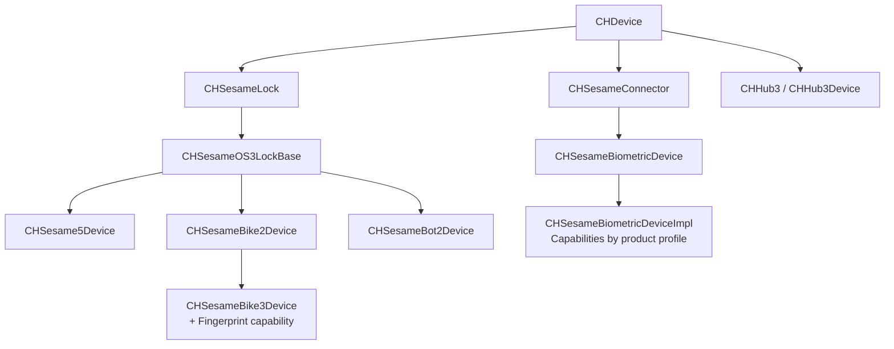

# SesameOS3 iOS

日本語 | [简体中文](README_zh-CN.md) | [English](README_en.md)

CANDY HOUSE の iOS / watchOS Demo App と Swift 製 Sesame SDK を収録したオープンソースプロジェクトです。現在は Sesame OS3 デバイスを中心に、BLE 接続、登録、操作、状態同期、ファームウェア更新を提供しています。

- [CANDY HOUSE 公式サイト](https://jp.candyhouse.co/)
- [App Store](https://apps.apple.com/app/id1532692301/)
- [TestFlight](https://testflight.apple.com/join/Rok4GOFD/)

## SDK の導入

### 動作環境

- Xcode 15 以降
- Swift 5.9 以降
- iOS 16 以降 / watchOS 9 以降

### 1. Swift Package Manager で追加する

Xcode の **File > Add Package Dependencies...** から、次の URL を追加します。

```text
https://github.com/CANDY-HOUSE/SesameSDK_iOS_with_DemoApp.git
```

`Package.swift` から追加する場合は、`<version>` を [Tags](https://github.com/CANDY-HOUSE/SesameSDK_iOS_with_DemoApp/tags) にある利用したいバージョンタグへ置き換えてください。

```swift
dependencies: [
    .package(
        url: "https://github.com/CANDY-HOUSE/SesameSDK_iOS_with_DemoApp.git",
        from: "<version>"
    )
]
```

利用するターゲットに `SesameSDK` を追加し、Swift ファイルで読み込みます。

```swift
import SesameSDK
```

### 2. Bluetooth 権限を設定する

アプリの `Info.plist` に Bluetooth の利用目的を追加してください。バックグラウンドで BLE 接続を継続する場合は、Background Modes の `bluetooth-central` も有効にします。

```xml
<key>NSBluetoothAlwaysUsageDescription</key>
<string>Sesame デバイスへの接続に Bluetooth を使用します。</string>
<key>NSBluetoothPeripheralUsageDescription</key>
<string>Sesame デバイスとの Bluetooth 通信に使用します。</string>
```

### 3. CANDY HOUSE サービスを初期化する

Sesame OS3 の登録やクラウド機能を使用する場合、アプリの Bundle に `awsconfiguration.json` を追加し、起動時にサービスを初期化します。

```swift
CHAWSManager.initialize { _, error in
    guard error == nil else { return }
    CHAPIClient.initialize()
}
```

完全な実装は Demo App の [`AppDelegate.swift`](SesameUI/SesameUI/Source/AppDelegate.swift) と [`GeneralTabViewController.swift`](SesameUI/SesameUI/Source/TabViewController/GeneralTabViewController.swift) を参照してください。

公開 Demo の CANDY HOUSE サービス設定は評価用途であり、リクエスト数などに制限が設けられる場合があります。本番環境では独自の AWS / Push Notification 設定を使用し、認証情報をリポジトリへコミットしないでください。

### 4. デバイスを検出・登録する

```swift
final class DeviceScanner: CHBleManagerDelegate, CHDeviceStatusDelegate {
    private var target: CHDevice?

    func start() {
        CHBluetoothCenter.shared.delegate = self
        CHBluetoothCenter.shared.enableScan { _ in }
    }

    func didDiscoverUnRegisteredCHDevices(_ devices: [CHDevice]) {
        guard let device = devices.first else { return }
        target = device
        device.delegate = self
        if device.deviceStatus == .receivedBle() {
            device.connect { _ in }
        }
    }

    func onBleDeviceStatusChanged(
        device: CHDevice,
        status: CHDeviceStatus,
        shadowStatus: CHDeviceStatus?
    ) {
        guard status == .readyToRegister(), device.deviceId == target?.deviceId else { return }
        device.register { result in
            if case .failure(let error) = result {
                print(error.localizedDescription)
            }
        }
    }
}
```

登録済みデバイスは `CHDeviceManager` から取得できます。

```swift
CHDeviceManager.shared.getCHDevices { result in
    if case let .success(devices) = result {
        let pairedDevices = devices.data
    }
}
```

## プロジェクト構成

| パス | 説明 |
| --- | --- |
| `Package.swift` | `SesameSDK` と `AESc` を公開する Swift Package 定義 |
| `Sources/SesameSDK` | BLE、OS3 デバイス、ローカル DB、クラウド通信 |
| `Sources/SesameSDK/Ble/SesameOS3` | 現在メンテナンスしている OS3 実装 |
| `SesameUI` | iOS / watchOS Demo App、Widget、Intent、Notification Extension |

## OS3 デバイス構成


```mermaid
flowchart TB
    Device[CHDevice]

    Device --> Lock[CHSesameLock]
    Lock --> LockBase[CHSesameOS3LockBase]
    LockBase --> S5[CHSesame5Device]
    LockBase --> Bike2[CHSesameBike2Device]
    Bike2 --> Bike3[CHSesameBike3Device<br/>+ Fingerprint capability]
    LockBase --> Bot2[CHSesameBot2Device]

    Device --> Connector[CHSesameConnector]
    Connector --> Bio[CHSesameBiometricDevice]
    Bio --> BioImpl[CHSesameBiometricDeviceImpl<br/>Capabilities by product profile]

    Device --> Hub[CHHub3 / CHHub3Device]
```

### メンテナンス対象製品

製品範囲は `CHProductModel` を基準とし、実際の Device 実装ごとに分類しています。

| Device 実装 | 製品 |
| --- | --- |
| `CHSesame5Device` | Sesame 5、Sesame 5 Pro、Sesame 5 US、Sesame 6、Sesame 6 Pro、Sesame 6 Pro SlidingDoor、Sesame miwa、BLE Connector 1 |
| `CHSesameBike2Device` | Sesame Bike 2 |
| `CHSesameBike3Device` | Sesame Bike 3（指紋機能） |
| `CHSesameBot2Device` | Sesame Bot 2、Sesame Bot 3 |
| `CHSesameBiometricDeviceImpl` | Open Sensor 1/2、Remote、Remote Nano、Sesame Touch 1/1 Pro/2/2 Pro、Sesame Face 1/1 Pro/1 AI/1 Pro AI/2/2 Pro/2 AI/2 Pro AI |
| `CHHub3Device` | Hub 3、Hub 3 LTE |

> メンテナンス終了：Sesame 3（`sesame2`）、WiFi Module 2（`wifiModule2`）、Sesame Bot 1（`sesameBot`）、Sesame Bike 1（`bikeLock`）、Sesame 4（`sesame4`）。SesameOS2 実装もメンテナンス対象外です。

### 生体認証 Capability

`CHSesameBiometricDeviceImpl` は製品 Profile に応じて Capability を組み合わせます。

| 製品シリーズ | Capability |
| --- | --- |
| Touch | Card、Fingerprint |
| Touch Pro | Card、Fingerprint、Passcode |
| Face | Card、Fingerprint、Palm、Face |
| Face Pro | Card、Fingerprint、Passcode、Palm、Face |
| Face AI | Palm、Face |
| Face Pro AI | Passcode、Palm、Face |

関連 API：`CHCardCapable`、`CHFingerPrintCapable`、`CHPassCodeCapable`、`CHPalmCapable`、`CHFaceCapable`、`CHRemoteNanoCapable`。

## メンテナンス方針

- 新製品は `CHProductModel` に追加し、対応する OS3 Device 実装へマッピングします。
- 共通処理は基底クラスへ集約し、製品差分は専用実装または Capability の組み合わせで表現します。
- `Sources/SesameSDK/Ble/SesameOS2` は互換性維持のための旧実装であり、現在のメンテナンス対象外です。
