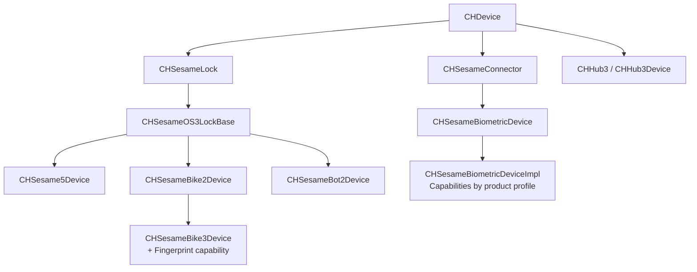

# SesameOS3 iOS

[日本語](README.md) | [简体中文](README_zh-CN.md) | English

An open-source project containing the CANDY HOUSE iOS / watchOS Demo App and the Swift-based Sesame SDK. The project currently focuses on Sesame OS3 devices and provides BLE connectivity, registration, control, state synchronization, and firmware updates.

- [CANDY HOUSE official website](https://jp.candyhouse.co/)
- [App Store](https://apps.apple.com/app/id1532692301/)
- [TestFlight](https://testflight.apple.com/join/Rok4GOFD/)

## Integrating the SDK

### Requirements

- Xcode 15 or later
- Swift 5.9 or later
- iOS 16 or later / watchOS 9 or later

### 1. Add the Swift package

In Xcode, select **File > Add Package Dependencies...** and enter:

```text
https://github.com/CANDY-HOUSE/SesameSDK_iOS_with_DemoApp.git
```

When using `Package.swift`, replace `<version>` with the desired version tag from [Tags](https://github.com/CANDY-HOUSE/SesameSDK_iOS_with_DemoApp/tags):

```swift
dependencies: [
    .package(
        url: "https://github.com/CANDY-HOUSE/SesameSDK_iOS_with_DemoApp.git",
        from: "<version>"
    )
]
```

Add `SesameSDK` to the required target, then import it in Swift:

```swift
import SesameSDK
```

### 2. Configure Bluetooth access

Add a Bluetooth usage description to the app's `Info.plist`. To maintain BLE connections in the background, also enable `bluetooth-central` under Background Modes.

```xml
<key>NSBluetoothAlwaysUsageDescription</key>
<string>Bluetooth is used to connect to Sesame devices.</string>
<key>NSBluetoothPeripheralUsageDescription</key>
<string>Bluetooth is used to communicate with Sesame devices.</string>
```

### 3. Initialize CANDY HOUSE services

Sesame OS3 registration and cloud features require `awsconfiguration.json` in the app bundle. Initialize the services when the app starts:

```swift
CHAWSManager.initialize { _, error in
    guard error == nil else { return }
    CHAPIClient.initialize()
}
```

See [`AppDelegate.swift`](SesameUI/SesameUI/Source/AppDelegate.swift) and [`GeneralTabViewController.swift`](SesameUI/SesameUI/Source/TabViewController/GeneralTabViewController.swift) in the Demo App for the complete setup.

The public Demo configuration for CANDY HOUSE services is intended for evaluation and may be subject to request or usage limits. For production, use your own AWS and push-notification configuration, and never commit credentials to the repository.

### 4. Discover and register a device

```swift
final class DeviceScanner: CHBleManagerDelegate, CHDeviceStatusDelegate {
    private var target: CHDevice?

    func start() {
        CHBluetoothCenter.shared.delegate = self
        CHBluetoothCenter.shared.enableScan { _ in }
    }

    func didDiscoverUnRegisteredCHDevices(_ devices: [CHDevice]) {
        guard let device = devices.first else { return }
        target = device
        device.delegate = self
        if device.deviceStatus == .receivedBle() {
            device.connect { _ in }
        }
    }

    func onBleDeviceStatusChanged(
        device: CHDevice,
        status: CHDeviceStatus,
        shadowStatus: CHDeviceStatus?
    ) {
        guard status == .readyToRegister(), device.deviceId == target?.deviceId else { return }
        device.register { result in
            if case .failure(let error) = result {
                print(error.localizedDescription)
            }
        }
    }
}
```

After registration, retrieve paired devices through `CHDeviceManager`:

```swift
CHDeviceManager.shared.getCHDevices { result in
    if case let .success(devices) = result {
        let pairedDevices = devices.data
    }
}
```

## Project structure

| Path | Description |
| --- | --- |
| `Package.swift` | Swift Package definition exposing `SesameSDK` and `AESc` |
| `Sources/SesameSDK` | BLE, OS3 devices, local database, and cloud communication |
| `Sources/SesameSDK/Ble/SesameOS3` | Currently maintained OS3 implementations |
| `SesameUI` | iOS / watchOS Demo App, widgets, intents, and notification extensions |

## OS3 device architecture



### Maintained products

The product range is defined by `CHProductModel` and grouped by the actual Device implementation.

| Device implementation | Products |
| --- | --- |
| `CHSesame5Device` | Sesame 5, Sesame 5 Pro, Sesame 5 US, Sesame 6, Sesame 6 Pro, Sesame 6 Pro SlidingDoor, Sesame miwa, BLE Connector 1 |
| `CHSesameBike2Device` | Sesame Bike 2 |
| `CHSesameBike3Device` | Sesame Bike 3 (with fingerprint capability) |
| `CHSesameBot2Device` | Sesame Bot 2, Sesame Bot 3 |
| `CHSesameBiometricDeviceImpl` | Open Sensor 1/2, Remote, Remote Nano, Sesame Touch 1/1 Pro/2/2 Pro, Sesame Face 1/1 Pro/1 AI/1 Pro AI/2/2 Pro/2 AI/2 Pro AI |
| `CHHub3Device` | Hub 3, Hub 3 LTE |

> No longer maintained: Sesame 3 (`sesame2`), WiFi Module 2 (`wifiModule2`), Sesame Bot 1 (`sesameBot`), Sesame Bike 1 (`bikeLock`), and Sesame 4 (`sesame4`). SesameOS2 implementations are also outside the current maintenance scope.

### Biometric capabilities

`CHSesameBiometricDeviceImpl` assembles capabilities based on each product profile.

| Product family | Capabilities |
| --- | --- |
| Touch | Card, fingerprint |
| Touch Pro | Card, fingerprint, passcode |
| Face | Card, fingerprint, palm, face |
| Face Pro | Card, fingerprint, passcode, palm, face |
| Face AI | Palm, face |
| Face Pro AI | Passcode, palm, face |

Related APIs: `CHCardCapable`, `CHFingerPrintCapable`, `CHPassCodeCapable`, `CHPalmCapable`, `CHFaceCapable`, and `CHRemoteNanoCapable`.

## Maintenance policy

- Add new products to `CHProductModel` and map them to the corresponding OS3 Device implementation.
- Keep shared behavior in base classes; implement product differences through dedicated implementations or Capability composition.
- `Sources/SesameSDK/Ble/SesameOS2` contains legacy compatibility code and is outside the current maintenance scope.
