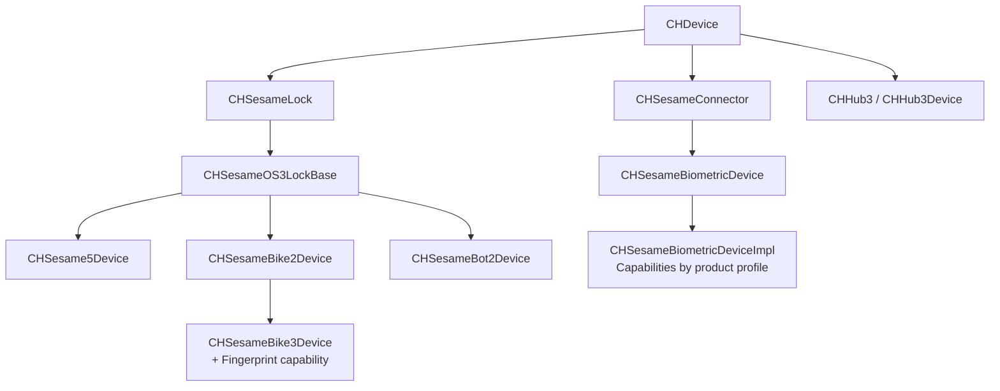

# SesameOS3 iOS

[日本語](README.md) | 简体中文 | [English](README_en.md)

CANDY HOUSE iOS / watchOS Demo App 与 Swift Sesame SDK 开源项目。当前项目聚焦 Sesame OS3 设备，提供 BLE 连接、注册、控制、状态同步与固件升级能力。

- [CANDY HOUSE 官网](https://jp.candyhouse.co/)
- [App Store](https://apps.apple.com/app/id1532692301/)
- [TestFlight](https://testflight.apple.com/join/Rok4GOFD/)

## 接入 SDK

### 开发环境

- Xcode 15 或更高版本
- Swift 5.9 或更高版本
- iOS 16 或更高版本 / watchOS 9 或更高版本

### 1. 通过 Swift Package Manager 添加依赖

在 Xcode 中选择 **File > Add Package Dependencies...**，添加以下地址：

```text
https://github.com/CANDY-HOUSE/SesameSDK_iOS_with_DemoApp.git
```

通过 `Package.swift` 添加时，请将 `<version>` 替换为 [Tags](https://github.com/CANDY-HOUSE/SesameSDK_iOS_with_DemoApp/tags) 中需要使用的版本标签：

```swift
dependencies: [
    .package(
        url: "https://github.com/CANDY-HOUSE/SesameSDK_iOS_with_DemoApp.git",
        from: "<version>"
    )
]
```

为需要使用 SDK 的 Target 添加 `SesameSDK`，然后在 Swift 文件中导入：

```swift
import SesameSDK
```

### 2. 配置蓝牙权限

在应用的 `Info.plist` 中添加蓝牙用途说明。如需在后台保持 BLE 连接，还应在 Background Modes 中启用 `bluetooth-central`。

```xml
<key>NSBluetoothAlwaysUsageDescription</key>
<string>使用蓝牙连接 Sesame 设备。</string>
<key>NSBluetoothPeripheralUsageDescription</key>
<string>使用蓝牙与 Sesame 设备通信。</string>
```

### 3. 初始化 CANDY HOUSE 服务

使用 Sesame OS3 注册和云端功能时，需要把 `awsconfiguration.json` 加入应用 Bundle，并在应用启动时初始化服务：

```swift
CHAWSManager.initialize { _, error in
    guard error == nil else { return }
    CHAPIClient.initialize()
}
```

完整实现可参考 Demo App 中的 [`AppDelegate.swift`](SesameUI/SesameUI/Source/AppDelegate.swift) 与 [`GeneralTabViewController.swift`](SesameUI/SesameUI/Source/TabViewController/GeneralTabViewController.swift)。

公共 Demo 使用的 CANDY HOUSE 服务配置仅供评估，可能存在请求次数等限制。生产环境请使用自己的 AWS 与推送通知配置，并且不要把凭证提交到代码仓库。

### 4. 发现并注册设备

```swift
final class DeviceScanner: CHBleManagerDelegate, CHDeviceStatusDelegate {
    private var target: CHDevice?

    func start() {
        CHBluetoothCenter.shared.delegate = self
        CHBluetoothCenter.shared.enableScan { _ in }
    }

    func didDiscoverUnRegisteredCHDevices(_ devices: [CHDevice]) {
        guard let device = devices.first else { return }
        target = device
        device.delegate = self
        if device.deviceStatus == .receivedBle() {
            device.connect { _ in }
        }
    }

    func onBleDeviceStatusChanged(
        device: CHDevice,
        status: CHDeviceStatus,
        shadowStatus: CHDeviceStatus?
    ) {
        guard status == .readyToRegister(), device.deviceId == target?.deviceId else { return }
        device.register { result in
            if case .failure(let error) = result {
                print(error.localizedDescription)
            }
        }
    }
}
```

注册完成后，可通过 `CHDeviceManager` 获取已配对设备：

```swift
CHDeviceManager.shared.getCHDevices { result in
    if case let .success(devices) = result {
        let pairedDevices = devices.data
    }
}
```

## 项目结构

| 路径 | 说明 |
| --- | --- |
| `Package.swift` | 定义 `SesameSDK` 与 `AESc` 的 Swift Package |
| `Sources/SesameSDK` | BLE、OS3 设备实现、本地数据库及云端通信 |
| `Sources/SesameSDK/Ble/SesameOS3` | 当前维护的 OS3 实现 |
| `SesameUI` | iOS / watchOS Demo App、Widget、Intent 与通知扩展 |

## OS3 设备架构



### 当前维护产品

产品范围以 `CHProductModel` 为准，并按实际 Device 实现分组：

| Device 实现 | 产品 |
| --- | --- |
| `CHSesame5Device` | Sesame 5、Sesame 5 Pro、Sesame 5 US、Sesame 6、Sesame 6 Pro、Sesame 6 Pro SlidingDoor、Sesame miwa、BLE Connector 1 |
| `CHSesameBike2Device` | Sesame Bike 2 |
| `CHSesameBike3Device` | Sesame Bike 3（指纹能力） |
| `CHSesameBot2Device` | Sesame Bot 2、Sesame Bot 3 |
| `CHSesameBiometricDeviceImpl` | Open Sensor 1/2、Remote、Remote Nano、Sesame Touch 1/1 Pro/2/2 Pro、Sesame Face 1/1 Pro/1 AI/1 Pro AI/2/2 Pro/2 AI/2 Pro AI |
| `CHHub3Device` | Hub 3、Hub 3 LTE |

> 不再维护：Sesame 3（`sesame2`）、WiFi Module 2（`wifiModule2`）、Sesame Bot 1（`sesameBot`）、Sesame Bike 1（`bikeLock`）、Sesame 4（`sesame4`）。SesameOS2 实现同样不在维护范围内。

### 生物识别能力

`CHSesameBiometricDeviceImpl` 根据产品 Profile 组合 Capability：

| 产品系列 | Capability |
| --- | --- |
| Touch | 卡片、指纹 |
| Touch Pro | 卡片、指纹、密码 |
| Face | 卡片、指纹、掌纹、人脸 |
| Face Pro | 卡片、指纹、密码、掌纹、人脸 |
| Face AI | 掌纹、人脸 |
| Face Pro AI | 密码、掌纹、人脸 |

相关 API：`CHCardCapable`、`CHFingerPrintCapable`、`CHPassCodeCapable`、`CHPalmCapable`、`CHFaceCapable` 与 `CHRemoteNanoCapable`。

## 维护约定

- 新产品需先在 `CHProductModel` 中登记，并映射到对应的 OS3 Device 实现。
- 共性行为优先收敛到基础类；产品差异通过独立实现或 Capability 组合完成。
- `Sources/SesameSDK/Ble/SesameOS2` 仅为历史兼容代码，不属于当前维护范围。
