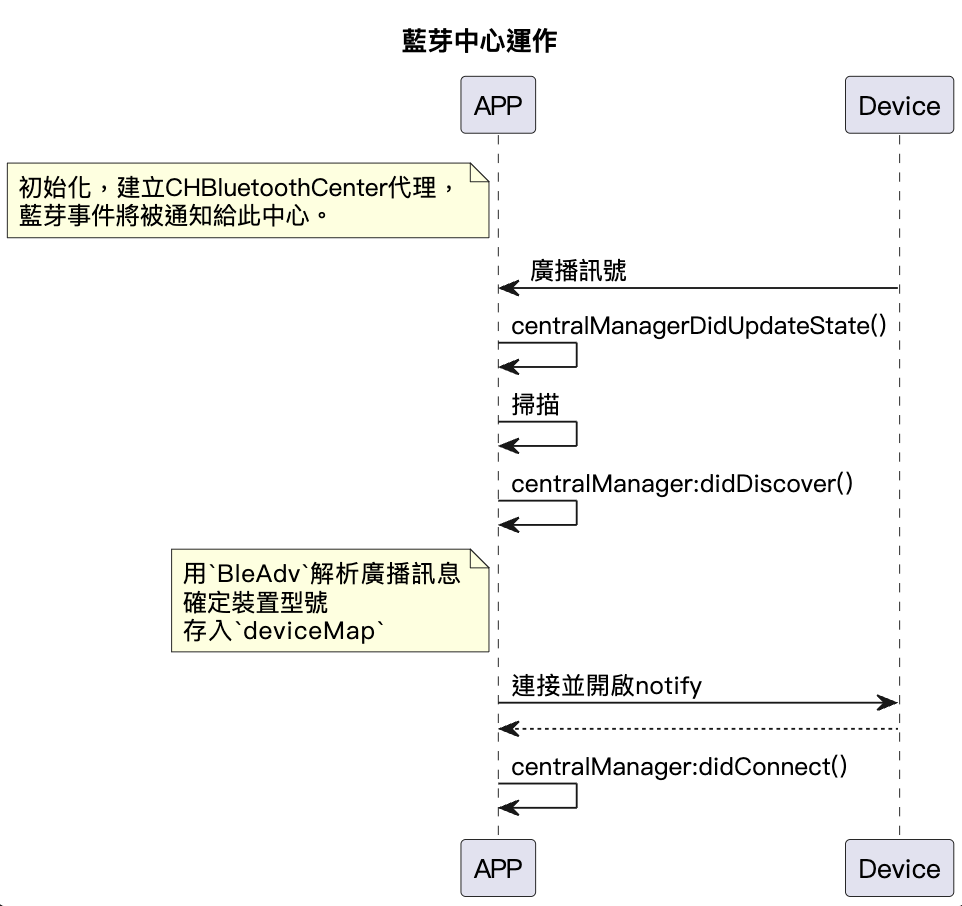

# CHBluetoothCenter 類別說明

public class `CHBluetoothCenter` - 此為 APP 藍芽數據中心，封裝了與藍牙相關的功能，進行設備掃描、連接和斷連接等操作。

## 循序圖

<p align="left" >
  
</p>

## 屬性

- `shared`: 初始化階段創建藍芽中心在此 APP 中的單例實例，並初始化了 `centralManager` 和 `discoverUnregisterTime`
- `delegate`: 用於回傳未註冊設備的代理
- `statusDelegate`: 用於回傳掃描狀態的代理
- `centralManager`: CBCentralManager 的實例，用於執行所有與 CoreBluetooth 相關的操作。
- `deviceMap`: 存儲已發現的 CHDevice
- `scanEnabled`: 表示是否啟用掃描
- `discoverUnregisterTimer`: 用於定時檢查未註冊的設備的計時器
- `scanning`: 當前的掃描狀態。

## 方法

```swift
enableScan(result: @escaping (CHResult<CHEmpty>))
//啟動對藍牙裝置的掃描

disableScan(result: @escaping (CHResult<CHEmpty>))
//停止對藍牙裝置的掃描

disConnectAll(result: @escaping (CHResult<CHEmpty>))
//斷開與所有已連接裝置的連接
```

## 列舉

- `CHScanStatus` - 掃描狀態：.enable, .disable, .error 時， 藍芽狀態(`CHBleStatus`)開啟 或 .bleClose 時，藍芽狀態關閉。
- `CHBleStatus` - 藍芽狀態，詳見代碼。
- `CHProductModel` 所有 CANDYHOUSE 產品的模型定義(依編號分類)，包含下列內容:

  - 設備型號 deviceModel
  - 設備名稱 deviceModelName
  - 設備實例 chDeviceFactory

### 協議與擴展

- 實現`CBCentralManagerDelegate` - 此代理對藍牙狀態的變化、掃描到新的藍牙裝置、連接到藍牙裝置時，做出反應。
- 實現`CBPeripheralDelegate` - 此代理處理關於藍芽外圍設備的事件，以下為處理方法：

```Swift
public func centralManager(_ central: CBCentralManager,  didDiscover peripheral: CBPeripheral,dvertisementData: [String: Any],  rssi RSSI: NSNumber)
//創建新的 BleAdv 對象來儲存廣播數據，並且嘗試從 deviceMap 中獲取對應的設備對象，如果沒有找到，則創建一個新的設備對象。

public func centralManager(_ central: CBCentralManager,didConnect peripheral: CBPeripheral)
//中心設備成功連接到一個外圍設備時調用：將設備狀態設為 .waitingGatt()，並開始尋找此外圍設備的服務。

public func centralManager(_ central: CBCentralManager,didDisconnectPeripheral peripheral: CBPeripheral,error: Error?)
//當與外設的連接被斷開時調用，清除與設備相關聯的廣播數據。

public func centralManager(_ central: CBCentralManager, didFailToConnect peripheral: CBPeripheral, error: Error?)
//當嘗試連接到外圍設備失敗時調用。將設備的狀態設置為 .receivedBle()，並記錄error log。
```
