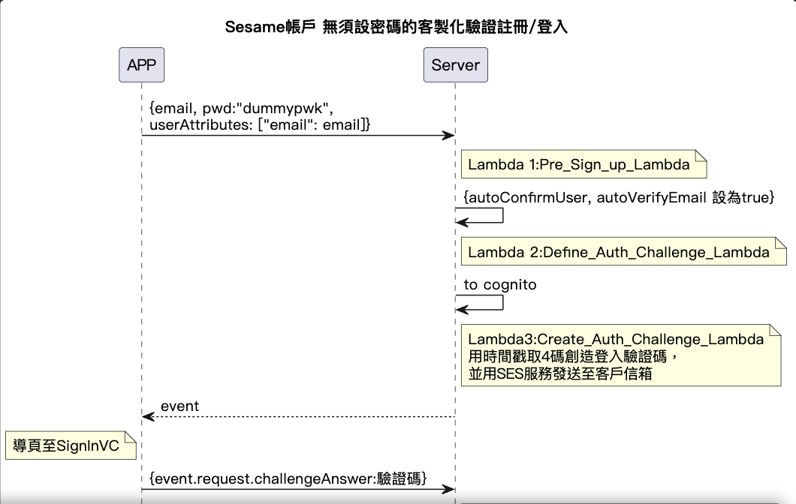

# SignUpVC 註冊頁(loginVC)

<p align="left" >
  
</p>

## 方法

```Swift
    @objc func signUp() {
        let email = contentTextField.text!
        CHUserAPIManager.shared.signUpWithEmail(email) { (signUpResult, signUpError) in // 以執行後結果判斷:
            if signUpError == nil {
                executeOnMainThread {
                    self.navigateToSignIn() // 1.註冊成功導至輸入驗證碼頁
                    ViewHelper.hideLoadingView(view: self.view)
                }
            } else if case .usernameExists(_) = signUpError as? AWSMobileClientError { //2.用戶已存在，導至輸入驗證碼頁
                executeOnMainThread {
                    self.navigateToSignIn()
                    ViewHelper.hideLoadingView(view: self.view)
                }
            } else if (signUpError as NSError?)?.code == -1009 { //3.失敗跳提示:網路問題
                executeOnMainThread {
                    self.view.makeToast((signUpError! as NSError).errorDescription())
                    ViewHelper.hideLoadingView(view: self.view)
                }
            } else {
                executeOnMainThread {
                    ViewHelper.hideLoadingView(view: self.view) //4.失敗跳提示:客戶端錯誤
                    let errorMessage = (signUpError as? AWSMobileClientError)?.errorDescription()
                    self.view.makeToast(errorMessage)
                }
            }
        }
    }


```
