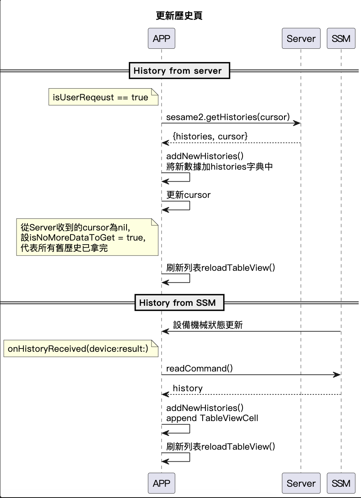

# class Sesame5HistoryVC: History 設備操作的歷史紀錄

顯示單一設備的操作記錄，包含開關鎖時間、操作者名稱、歷史類型。繼承自`CHBaseTableViewController`，是個 TableView。
歷史來源:

- `SSM` publish
- 從 `server` 拉取

## 循序圖

<p align="left" >
  
</p>

## 屬性

- 渲染此頁面主資料`histories = [String: [CHSesame5History]]()`，key 為 UInt64 的時間戳，value 為對應該時間戳的 CHSesame5History
- `sesame2`: 當前設備 (CHSesame5||CHSesame2)
- `previousInexPath`: 上次 API 請求之前的 TableView 的第一個 section 的 row 數和所有 section 的數量。用來確認在新數據被加入後 ScrollView 滾動位置不會被突然改變, 及 TableView 應該滾動到哪個位置。
- `previousInexPath`: 上次 API 請求之前的 TableView 的第一個 section 的 row 數和所有 section 的數量。此變數用來確認在新數據被加入後，TableView 應該滾動到哪個位置。
- `isNoMoreDataToGet`當用戶滾動到 TableView 的頂部時，若 `isNoMoreDataToGet` 為 false，則會再次呼叫 getHistory 以獲取更多的歷史數據。
- `isReloadingTableView`、`isHangingTableViewReload`: 控制獲取和重新加載數據的標記

## 方法

## 主要類別 - CHSesame5HistoryData

儲存 Sesame5 裝置的歷史記錄資料，包括歷史 ID、歷史標籤(HistoryTag)、日期、時間戳和機械狀態。

### enum CHSesame5History :表示 Sesame5 裝置的各種歷史記錄類型

- 手動上鎖
- 手動解鎖
- 藍芽上鎖
- 藍芽解鎖
- wifi 上鎖
- wifi 解鎖

## 方法

```Swift
func eventToCHHistroy(historyEvent: CHSesame5HistoryEvent) -> CHSesame5History?
```

## class CHSesame5HistoryEvent: 單筆歷史事件

分為`CHSesame2HistoryEvent` 和 `CHSesame5HistoryEvent`

### 內容屬性

`recordID`: Int32，表示事件的記錄 ID。
`type`: UInt8，表示事件的類型。
`timeStamp`: UInt64，表示事件的時間戳。
`historyTag`: Data，表示事件的歷史標籤。
`devicePk`: String，表示設備的公鑰(四碼亂數)。
`parameter`: Data，內容為 mechStatus。

## Device extension

### 方法

```Swift
func getHistories(cursor: UInt?, _ result: @escaping CHResult<CHSesame5HistoryPayload>)
// 參數 isUserReqeust 請求是否由使用者主動發起。如果是，便會包含一個 cursor 來獲取更多的資料。

func postProcessHistory(_ historyData: Data)
```
