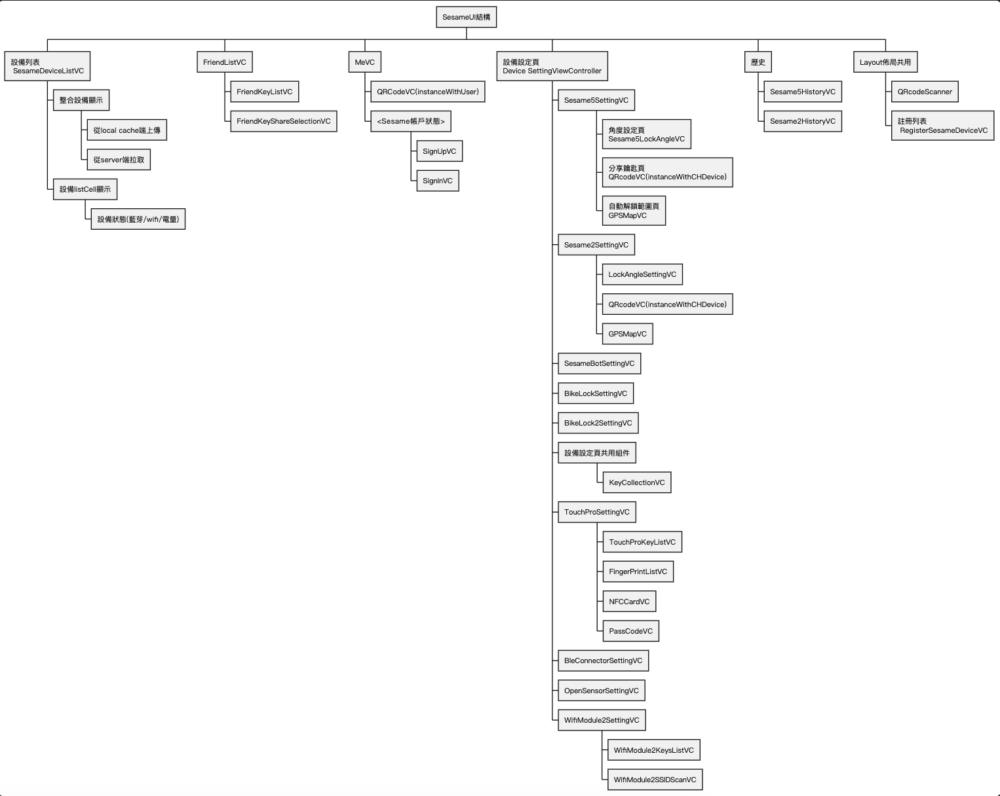

# iOS UI 架構說明

以視圖 View 為文件單位

  

## 常見相似名稱比較說明

- CHUserKey: 要傳給 Server 的 Sesame 設備格式(POST to user_devices)
- CHUser: APP 中的 AWS 用戶，內含(aws cognito)用戶屬性: subUUID, email,nickname/keyLevel, gtag

- CHDeviceKey: 要存入本地緩存(Core Data)的設備格式
- CHDevice: 所有設備需遵守的協議，在代碼中代表設備
- CHBaseDevice

* mSesameToken：手機與 ssm 藍芽連線時，ss5 傳來的 4 bytes 亂數，用於:
  - `Sesame5` <-> `APP` 間溝通的 token
  - `APP` <-> `Server` 訪問該 Sesame5 相關資料用的 token

## 命名縮寫

- VC: UIkit 中的 ViewController
