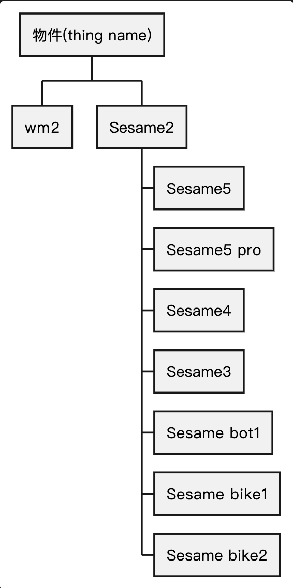

# CHIoTManager 類別說明

此 Class 用來管控 AWS Iot 服務相關的操作，以`shared` 建立單例。

## AWS Iot Core(Server)

  

### 官方文件

#### MQTT 協議(Sesame <-> Server)

https://docs.aws.amazon.com/zh_tw/iot/latest/developerguide/mqtt.html

#### 裝置影子(Device Shadow)

- 為每個裝置建立永久的虛擬版本，並提供儲和檢索 IoT 裝置的當前狀態。即使裝當下無連上網路，也能透過影子上的資料(json 格式)，提取該裝置的最新狀態。
- 訂閱影子:訂閱特定裝置影子的 MQTT 主題，以接收該影子的更新
  https://docs.aws.amazon.com/zh_tw/iot/latest/developerguide/using-device-shadows.html

## 屬性

- `awsIoTDataManager`: 管理與 AWS IoT 的連接和訂閱
- `awsIoTData`: 訪問 AWS IoT 服務的 AWS IoT Client 端
- `connectionStatus`: 與 MQTT 的連接狀態

## 方法

- 初始化設置 MQTT 和 AWS IoT 服務的相關配置
- `reconnect()`: 嘗試重新連接到 AWS IoT 服務
- `statusCallback(\_:)`: 在 MQTT 連接狀態改變時回調。最後再次更新 MQTT 狀態
  - 連線:`AWSIoTMQTTStatus` 為`.connected` :取消訂閱影子
  - 斷連:`AWSIoTMQTTStatus`從`.connected`改變:遍歷設備列表 1.裝置為 `CHSesameLock` => 將設備的 `deviceShadowStatus` 設為 nil 2.裝置為 `CHWifiModule2Device` => isConnectedToIoT 設為 false
- `getWifiModule2Shadow(\_:onResponse:)`: 發出請求以獲取特定裝置的陰影資訊。
- `subscribeWifiModule2Shadow(_:onResponse:)` `subscribeCHDeviceShadow(_:onResponse:)`: 訂閱特定裝置的陰影更新。當 Shadow 更新時，調用 Callback 函數
- `unsubscribeWifiModule2Shadow(_:)` `unsubscribeCHDeviceShadow(_:)`: 取消訂閱特定裝置的 Shadow 更新
- `sendCommandToWM2(_: _:onResponse:)`: 發送命令給 wm2
